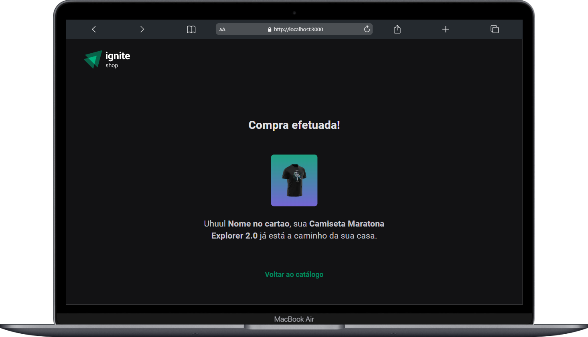

<h1 align="center" style="color: rgba(68, 131, 97, 1);">Ignite Shop - NextJs</h1>

    Esse projeto foi desenvolvido durante o módulo 4: Fundamentos do NextJs no bootcamp <a href="https://lp.rocketseat.com.br/ignite?&&" style="color: rgba(68, 131, 97, 1); text-decoration: underline;">Ignite</a> (Rocketseat) com o objetivo de criar um projeto completo com o framework <strong>NextJs</strong>, passando por conceitos de Single Page Aplication (SPA), server-side rendering (SSR) e static-site generation (SSG).
  

  <a href="#-tecnologias-e-bibliotecas">Tecnologias</a>&nbsp;&nbsp;&nbsp;|&nbsp;&nbsp;&nbsp;
  <a href="#-sobre-o-projeto">Sobre</a>&nbsp;&nbsp;&nbsp;|&nbsp;&nbsp;&nbsp;
  <a href="#-layout">Layout</a>&nbsp;&nbsp;&nbsp;|&nbsp;&nbsp;&nbsp;
  <a href="#-como-executar">Como executar</a>

  

 

  
  

 

## ✏️ Tecnologias e bibliotecas

Para a construção do projeto, foram utilizadas as seguintes tecnologias:

- [NextJs](https://nextjs.org/)
- [TypeScript](https://www.typescriptlang.org/)
- [Stitches](https://stitches.dev/)
- [Keen-slider](https://keen-slider.io/)
- [Stripe](https://stripe.com/docs)
- [Axios](https://axios-http.com/docs/intro)

 

---

## ✨ Sobre o projeto

Esse projeto foi desenvolvido durante o módulo 4: Fundamentos do NextJs no bootcamp <a href="https://lp.rocketseat.com.br/ignite?&&" style="color: rgba(68, 131, 97, 1); text-decoration: underline;">Ignite</a> (Rocketseat) com o objetivo de criar um projeto completo com o framework <strong>NextJs</strong>, passando por conceitos de Single Page Aplication (SPA), server-side rendering (SSR) e static-site generation (SSG).

Foram praticados na aplicação os seguinte conceitos e métodos:

- Roteamento baseado em arquivos físicos;
- Dynamic routes;
- Otimização de imagens utilizando o componente Next `<Image />`;
- SSR e SSG utilizando os métodos `getServerSideProps()` e `getStatitProps()`;
- Client-side navigation utilizando o componente Next `<Link />`;
- Informações estáticas utilizando o método `getStaticPaths()`;
- API Routes e Stripe checkout Session.

### 💄 Layout

O layout da aplicação foi desenvolvido e forneciso pela equipe da Rocketseat.

<a href="https://www.figma.com/file/OIJJEW24DFiJO6XLqHw2DM/Ignite-Shop/duplicate" style="color: rgba(68, 131, 97, 1); text-decoration: underline;">Clique aqui</a> e acesse o conteúdo!

 

---

## 📄 Como executar

Para executar o projeto, rode o seguinte código no terminal após clonar o mesmo:

- `npm run dev` para executar a aplicação em modo de desenvolvimento, com hot-code reloading e reporte de erro;
- `npm run build` para criar uma versão otimizada da production build;
- `npm run start` para executar o projeto em modo de produção;

 

---
